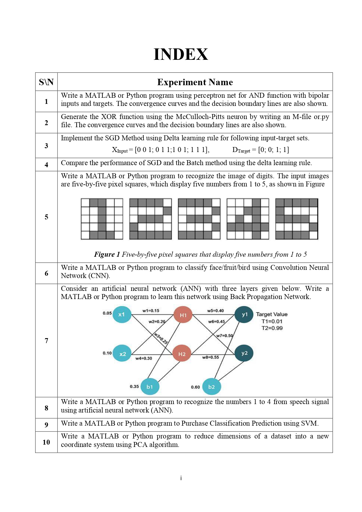

# NEURAL-NETWORK

[![Youtube][youtube-shield]][youtube-url]
[![Facebook][facebook-shield]][facebook-url]
[![Instagram][instagram-shield]][instagram-url]
[![LinkedIn][linkedin-shield]][linkedin-url]

Thanks for visiting my GitHub account! ***Please share this repo, but don't download it.***

## About Neural Network

A **neural network** is a method in artificial intelligence (AI) that teaches computers to process data in a way that is inspired by the human brain. It is a type of machine learning (ML) process, called deep learning, that uses interconnected nodes or neurons in a layered structure that resembles the human brain. It creates an adaptive system that computers use to learn from their mistakes and improve continuously. Thus, artificial neural networks attempt to solve complicated problems, like summarizing documents or recognizing faces, with greater accuracy.

### For More 
- Visit-> [https://en.wikipedia.org/wiki/Cellular_network](https://www.geeksforgeeks.org/neural-networks-a-beginners-guide/)

## Required Software
- Jupyter Notebook [Download](https://jupyter.org/install)
- Or, VS-Code [Download](https://code.visualstudio.com/)
- Or, Pycharm [Download](https://pycharm-community-edition.en.softonic.com/download)

## Features

|   |
|:---:|
|INDEX|
||

## Follow Me

    

<!-- MARKDOWN LINKS & IMAGES -->

[youtube-shield]: https://img.shields.io/badge/-Youtube-black.svg?style=flat-square&logo=youtube&color=555&logoColor=white
[youtube-url]: https://youtube.com/@learnwithfair
[facebook-shield]: https://img.shields.io/badge/-Facebook-black.svg?style=flat-square&logo=facebook&color=555&logoColor=white
[facebook-url]: https://facebook.com/learnwithfair
[instagram-shield]: https://img.shields.io/badge/-Instagram-black.svg?style=flat-square&logo=instagram&color=555&logoColor=white
[instagram-url]: https://instagram.com/learnwithfair
[linkedin-shield]: https://img.shields.io/badge/-LinkedIn-black.svg?style=flat-square&logo=linkedin&colorB=555
[linkedin-url]: https://linkedin.com/company/learnwithfair

